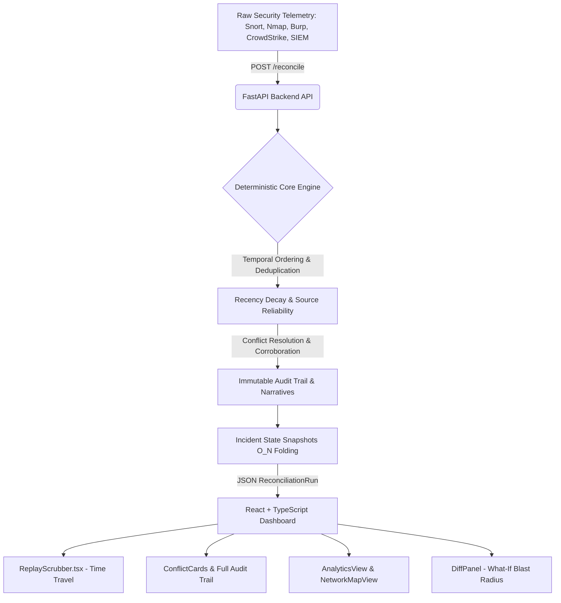

# SOC Reconciliation Engine

[](https://fastapi.tiangolo.com/)
[](https://reactjs.org/)
[](https://www.framer.com/motion/)
[](https://github.com)

> **A mathematically sound, deterministic temporal reconciliation and what-if analysis engine for multi-source security operations center (SOC) telemetry.**

---

## ⚡ Executive Summary

Modern Security Operations Centers (SOCs) ingest millions of events daily from disparate security tools—EDRs (CrowdStrike), Network Scanners (Nmap), Web Proxies (Burp Suite), IDS/IPS (Snort), SIEMs (Splunk, Microsoft Sentinel), and Endpoint Logs (PowerShell). 

These tools frequently produce **contradictory truth claims** about critical infrastructure entities:
* *Nmap* reports port `445` is closed at `10:00:00`.
* *Snort* detects an active exploit on port `445` at `10:00:02`.
* *CrowdStrike* reports host `10.0.0.5` as healthy at `10:01:00`, but a delayed *PowerShell* execution log arrives at `10:02:00` proving an unmanaged `psexec` lateral movement occurred at `10:00:45`.

Alert fatigue, out-of-order log delivery, and conflicting signals stall incident response teams. 

**SOC Reconciliation Engine** mathematically resolves these temporal and multi-source conflicts in sub-millisecond execution times. Using a pure functional pipeline parameterized with recency decay, source reliability weighting, and corroboration bonuses, the engine produces **deterministic single-source-of-truth states, immutable audit narratives, and point-in-time incident reconstruction snapshots.**

---
## 📸 System Screenshots & Demo Walkthrough

Here is a visual overview of the SOC Reconciliation Engine in action:

### 🎥 Video Walkthrough
[](https://drive.google.com/file/d/1bxxqgr8hAig-I__soruMrq1uyIsze5V7/view?usp=sharing)
*(Click the badge above to watch the full live walkthrough video of the time-travel scrubber and conflict resolution engine).*

### 🖥️ Interface & Dashboard Screenshots


 


## 🚀 Key Features

### 1. Deterministic Multi-Factor Conflict Resolution
Resolves conflicting claims without nondeterministic LLM hallucinations or opaque heuristics:
$$\text{Final Score} = (\text{Source Reliability Weight} \times \text{Recency Decay}) + \text{Corroboration Bonus}$$
* **Source Reliability Matrix:** Tuned weights for primary security telemetry (CrowdStrike: `0.95`, Snort: `0.90`, Burp: `0.85`, Splunk: `0.85`, Sentinel: `0.85`, PowerShell: `0.80`, Nmap: `0.75`).
* **Recency Half-Life Decay:** Exponential decay curves ensure recent telemetry naturally overtakes stale state.
* **Corroboration Multiplier:** Independent cross-source validations grant confidence boosts.

### 2. Time-Travel Incident Scrubber
* Point-in-Time incident reconstruction with an interactive, physical scrubber.
* Allows SOC tier-2/3 analysts to slide across temporal frames ($T_0 \to T_{\text{now}}$) to inspect exactly how the engine's belief state evolved as out-of-order logs landed.

### 3. What-If Replay & Blast Radius Diffing
* Inject hypothetical or newly discovered late-arriving evidence into completed runs (`/replay/{run_id}`).
* Automatically calculates state divergence ($\Delta$) and highlights flipped verdicts and cascading blast radius impacts via 3D interactive cards.

### 4. Comprehensive SOC Investigation Views
* **Reconciled Decisions:** High-priority cards detailing winning claims, losing contenders, and mathematical confidence breakdowns.
* **Raw Claims By Tool:** Per-sensor telemetry audit trail allowing analysts to evaluate tool fidelity and false-positive rates.
* **Incident Analytics & Graphs:** Multi-dimensional charts visualizing source distribution, confidence distributions, conflict rates, and rule utilization.
* **Network Topology Map:** Dynamic entity graph visualizing compromised hosts, port exposures, and external C2 beacon vectors.
* **Telemetry Ingestion Modal:** Drag-and-drop or manual JSON payload feeder directly connected to the live reconciliation pipeline.

---

## 🏗️ Architecture Overview



For comprehensive architectural specifications and sequence diagrams, refer to [`docs/ARCHITECTURE.md`](docs/ARCHITECTURE.md) and [`docs/WORKFLOW.md`](docs/WORKFLOW.md).

---

## 🛠️ Tech Stack

* **Backend:** Python 3.11+, FastAPI, Pydantic v2, Uvicorn, Pytest, HTTPX.
* **Frontend:** React 18, TypeScript, Vite, Framer Motion, Lucide Icons, Vanilla CSS Design System (Cyberpunk/SOC Hazard Theme).
* **Containerization:** Docker, Docker Compose.

---

## ⚡ Quickstart Guide

### Prerequisites
* Python 3.10+
* Node.js 18+ and npm
* *(Optional)* Docker & Docker Compose

---

### Option A: Local Development (Recommended)

#### 1. Start the Backend
```bash
cd backend
python -m venv venv
# Windows
venv\Scripts\activate
# Linux/macOS
source venv/bin/activate

pip install -r requirements.txt
python -m uvicorn app.main:app --reload --port 8000
```
Backend API will be live at `http://localhost:8000` (Interactive Swagger docs at `http://localhost:8000/docs`).

#### 2. Start the Frontend
```bash
cd frontend
npm install
npm run dev
```
Frontend application will be accessible at `http://localhost:5173`.

---

### Option B: Docker Compose (Full Stack)

To spin up both backend and frontend in isolated containers:
```bash
docker compose up --build
```
* Frontend: `http://localhost:5173`
* Backend API: `http://localhost:8000`

---

## 🛡️ Authentication & Demo Access

The platform supports both local backend-authenticated sessions and instant demo evaluation:
* **Email:** `demo@recon.local` (or any custom operator email)
* **Password:** `admin123` (or any passkey during hackathon open-mode)
* **Instant Demo Mode:** Click **"LAUNCH DEMO MODE"** on the login screen to explore the system with 60+ pre-seeded multi-vector breach events.

---

## 📁 Repository Structure

```
recon-engine/
├── backend/
│   ├── app/
│   │   ├── api/          # FastAPI Route Handlers (reconcile, replay, diff, ingest, auth)
│   │   ├── core/         # Pure Deterministic Engine Logic (models, reorder, conflict, audit, replay)
│   │   └── main.py       # FastAPI Application Entrypoint & CORS Middleware
│   ├── tests/            # Automated Pytest Suite for Deterministic Pipeline
│   ├── Dockerfile
│   └── requirements.txt
├── frontend/
│   ├── src/
│   │   ├── components/   # React SOC Components (Scrubber, Cards, Timeline, Views, Modals)
│   │   ├── data/         # Synthetic Breach Scenario Generator (60+ Multi-source Events)
│   │   ├── theme/        # Hazard Yellow/Black Cyber Design Tokens
│   │   ├── App.tsx       # Main Reactive Application Shell
│   │   └── main.tsx      # Entrypoint & Routing
│   ├── Dockerfile
│   ├── package.json
│   └── vite.config.ts
├── docs/
│   ├── ARCHITECTURE.md   # System Architecture & Technical Specifications
│   ├── API.md            # REST API Contract & Data Models
│   └── WORKFLOW.md       # Mermaid Workflow & Sequence Diagrams
├── docker-compose.yml
└── README.md
```

---

## 🧪 Running Tests

Verify deterministic pipeline execution, deduplication rules, and conflict resolution scores:
```bash
cd backend
pytest -v
```

---

## 📜 License
MIT License. Built for the 2026 Ascend Hackathon.
