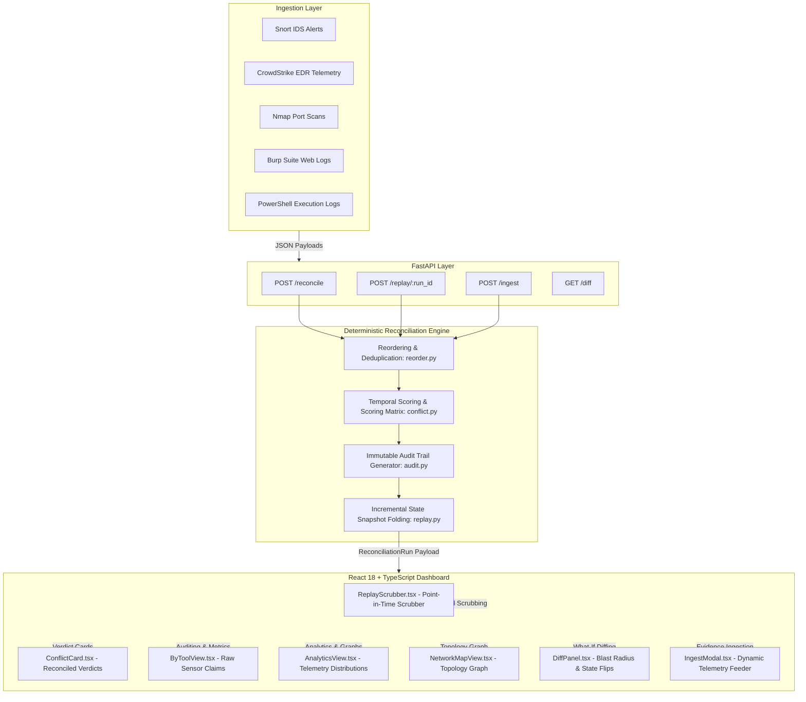

# System Architecture & Technical Specifications

This document outlines the architectural design, algorithmic principles, data modeling, and frontend-backend integration of the **SOC Reconciliation Engine**.

---

## 1. Architectural Philosophy & Constraints

The SOC Reconciliation Engine is engineered around three non-negotiable principles:

1. **100% Determinism:** Given the same set of input events $E$ and reference timestamp $T_{\text{injected}}$, the system produces the exact same output decisions, scores, and audit trails. The system does **not** rely on non-deterministic Large Language Models (LLMs) or external probabilistic services.
2. **Zero System-Clock Coupling:** Time is strictly treated as an explicit parameter (`injected_now`). No internal function calls `datetime.now()`, enabling complete temporal reproducibility, automated testing, and time-travel replay.
3. **Pure Functional Separation:** The backend logic is isolated inside `app/core/` as pure, side-effect-free functions. The FastAPI layer (`app/api/`) serves strictly as a thin HTTP serialization and contract validation interface.

---

## 2. End-to-End Component Architecture



---

## 3. Mathematical Conflict Resolution Model

When multiple security sensors emit conflicting observations for an identical entity (e.g., host `10.0.0.5` or port `445`), the engine evaluates each candidate claim using a deterministic multi-factor scoring function:

$$\text{Final Score}(e) = \left( W_{\text{source}}(e.\text{source}) \times D_{\text{recency}}(e.\text{timestamp}, T_{\text{now}}) \right) + B_{\text{corroboration}}(e)$$

### A. Source Reliability Weights ($W_{\text{source}}$)
Security tools have intrinsically differing fidelity levels depending on their architectural placement:
| Source | Weight ($W$) | Rationale |
| :--- | :---: | :--- |
| **CrowdStrike / EDR** | `0.95` | Kernel-level endpoint introspection; highest veracity. |
| **Snort / Network IDS** | `0.90` | Deep packet inspection with signature matching. |
| **Burp Suite / Proxy** | `0.85` | Application-layer HTTP transaction interception. |
| **Splunk / SIEM** | `0.85` | Centralized log aggregation and correlation. |
| **Microsoft Sentinel** | `0.85` | Cloud SIEM and telemetry collector. |
| **PowerShell Logs** | `0.80` | Host script block logging (prone to evasion/spoofing). |
| **Nmap / Scanner** | `0.75` | Point-in-time active probe; state may change rapidly. |

### B. Recency Decay ($D_{\text{recency}}$)
Telemetry confidence decays exponentially as the time delta between event timestamp $t_e$ and reference time $T_{\text{now}}$ increases:

$$D_{\text{recency}} = \exp\left( -\lambda \cdot \max(0, T_{\text{now}} - t_e) \right)$$

where $\lambda = \frac{\ln(2)}{\text{Half-Life}}$ (default half-life = 3600 seconds / 1 hour).

### C. Corroboration Bonus ($B_{\text{corroboration}}$)
If distinct, independent security tools produce corroborating claims for the same entity within a temporal window, each additional corroborating source grants an additive confidence bonus:

$$B_{\text{corroboration}} = \min\left(0.20, \; (\text{Independent Sources} - 1) \times 0.10\right)$$

---

## 4. Incremental State Folding & Incident Snapshots

To enable real-time scrubbing without recomputing the entire incident from scratch on the client, the backend constructs **Incident State Snapshots** via an $O(N)$ folding pipeline:

1. **Chronological Sorting:** All events are sorted by timestamp ascending, with ties broken by source priority.
2. **Sequential Step Execution:** The engine iterates through the ordered events one by one, maintaining a running dictionary of entity states.
3. **Snapshot Triggering:** When an event introduces a new entity state, modifies an existing verdict, or alters the winning confidence score, a new `IncidentStateSnapshot` is emitted.
4. **Deterministic Snapshot Hashing:** Each snapshot receives a cryptographic SHA-256 ID calculated from its timestamp and canonical state JSON:
   $$\text{Snapshot ID} = \text{SHA-256}(T_{\text{iso}} \;\|\; \text{CanonicalStateJSON})$$

---

## 5. Frontend & Backend Layer Mapping

| Backend Core Module (`app/core/`) | Frontend Component (`src/components/`) | Functional Responsibility |
| :--- | :--- | :--- |
| `models.py` | `src/types/` | Shared TypeScript interfaces for Events, Decisions, Snapshots, and Diffs. |
| `reorder.py` | `Timeline.tsx` | Chronological event sorting, duplicate flagging, and late-arrival detection. |
| `conflict.py` | `ConflictCard.tsx` | Multi-factor scoring, winning vs losing claim rendering, and 3D card flips. |
| `audit.py` | `AuditAccordion.tsx` | Plain-English narrative generation and immutable decision provenance logs. |
| `replay.py` | `ReplayScrubber.tsx` | Point-in-time state reconstruction, scrubber playhead dragging, and snapshot binding. |
| `diff.py` | `DiffPanel.tsx` | Decision divergence calculation, verdict flip alerts, and blast radius calculation. |
| `api/routes.py` | `IngestModal.tsx` | Live telemetry ingestion, JSON validation, and pipeline triggering. |

---

## 6. Directory Layout

```
recon-engine/
├── backend/
│   ├── app/
│   │   ├── api/
│   │   │   ├── auth.py       # Authentication endpoints (/auth/login, /auth/me)
│   │   │   └── routes.py     # Core API endpoints (/reconcile, /replay, /diff, /ingest)
│   │   ├── core/
│   │   │   ├── audit.py      # Narrative synthesis and immutable audit trail creation
│   │   │   ├── conflict.py   # Mathematical scoring and conflict resolution rules
│   │   │   ├── diff.py       # State comparison and blast radius calculation
│   │   │   ├── ingest.py     # JSON payload validation and normalization
│   │   │   ├── models.py     # Pydantic v2 data models and enums
│   │   │   ├── reorder.py    # Temporal sorting and deduplication
│   │   │   └── replay.py     # Incremental pipeline orchestration and snapshot generation
│   │   └── main.py           # FastAPI initialization, CORS middleware, and routing
│   ├── tests/                # Deterministic test suite
│   └── requirements.txt      # Python dependencies
├── frontend/
│   ├── src/
│   │   ├── components/       # UI Components (Scrubber, Cards, Timeline, Views, Navigation)
│   │   ├── data/             # Synthetic 60+ event breach dataset
│   │   ├── theme/            # Design system tokens and styling
│   │   ├── App.tsx           # Primary application layout and state manager
│   │   └── main.tsx          # React application root and routing
│   ├── package.json          # Node dependencies
│   └── vite.config.ts        # Vite configuration
└── docs/                     # Technical specifications and API documentation
```
