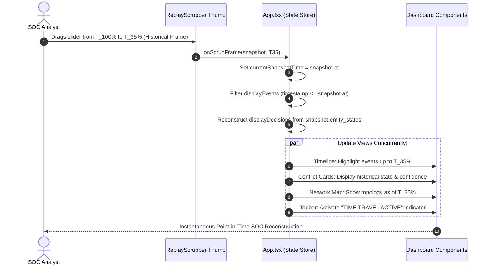

# System Workflows & Sequence Diagrams

This document illustrates the execution lifecycles and operational workflows of the **SOC Reconciliation Engine** using native Mermaid.js sequence diagrams.

---

## Workflow A: End-to-End Reconciliation Pipeline

Illustrates how raw telemetry flows from external sensors into the deterministic engine and renders onto the analyst dashboard.

```mermaid
sequenceDiagram
    autonumber
    actor Analyst as SOC Analyst (Browser)
    participant UI as React Frontend (App.tsx)
    participant API as FastAPI Backend (/reconcile)
    participant Reorder as reorder.py
    participant Conflict as conflict.py
    participant Audit as audit.py
    participant Replay as replay.py

    Analyst->>UI: Loads Dashboard / Requests Reconciliation
    UI->>API: POST /reconcile (Events Array, injected_now)
    
    rect rgb(30, 30, 30)
        note over API,Replay: Deterministic Pipeline Execution
        API->>Reorder: reorder_events(events, injected_now)
        Reorder-->>API: Chronologically sorted & deduplicated events
        
        API->>Replay: run_pipeline(ordered_events, injected_now)
        
        loop For each event in ordered sequence
            Replay->>Conflict: resolve(seen_events_so_far, injected_now)
            Conflict->>Conflict: Calculate Source Weights & Recency Decay
            Conflict->>Conflict: Compute Corroboration Bonuses
            Conflict-->>Replay: Intermediate Entity Decisions
            
            alt State Changed or New Verdict
                Replay->>Replay: Emit IncidentStateSnapshot (SHA-256 Hashed)
            end
        end
        
        Replay->>Audit: build_audit_trail(final_decisions, events, injected_now)
        Audit-->>Replay: Immutable Audit Records & Plain-English Narratives
        Replay-->>API: ReconciliationRun Object
    end
    
    API-->>UI: 200 OK (ReconciliationRun JSON)
    UI->>UI: Populate Event Timeline (Timeline.tsx)
    UI->>UI: Render Conflict Cards (ConflictCard.tsx)
    UI->>UI: Initialize Temporal Scrubber (ReplayScrubber.tsx)
    UI->>UI: Update Network Map & Analytics Views
    UI-->>Analyst: Interactive SOC Dashboard Ready
```

---

## Workflow B: What-If Replay & Diff Analysis

Illustrates how an analyst tests hypothetical counter-evidence or injects late-discovered telemetry to calculate blast radius and verdict changes.

```mermaid
sequenceDiagram
    autonumber
    actor Analyst as SOC Analyst
    participant Scrubber as ReplayScrubber.tsx
    participant Ingest as IngestModal.tsx / Dropzone
    participant API as FastAPI Backend
    participant DiffEngine as diff.py
    participant DiffView as DiffPanel.tsx

    Analyst->>Ingest: Drag-and-drop late evidence / Enter new JSON claim
    Ingest->>API: POST /replay/{baseline_run_id} (extra_events, injected_now)
    
    rect rgb(30, 30, 30)
        note over API,DiffEngine: Replay Execution & Delta Calculation
        API->>API: Retrieve baseline events from RUN_STORE
        API->>API: Append new evidence & execute run_pipeline()
        API-->>Ingest: Return updated ReconciliationRun
        
        Ingest->>API: GET /diff?baseline_run_id=X&updated_run_id=Y
        API->>DiffEngine: compute_diff(baseline_run, updated_run)
        DiffEngine->>DiffEngine: Identify Verdict Flips & Blast Radius
        DiffEngine-->>API: DecisionDiff[] Array
    end
    
    API-->>DiffView: 200 OK (DecisionDiff[])
    DiffView->>DiffView: Render Pulsing Hazard Flip Cards
    DiffView->>DiffView: Highlight Overridden Entities & Changed Rules
    DiffView-->>Analyst: Visual Blast Radius & Forensic Impact
```

---

## Workflow C: Point-in-Time Temporal Scrubbing (Time Travel)

Illustrates how the frontend reconstructs historical truth states as the analyst drags the playhead backward and forward across incident time.

